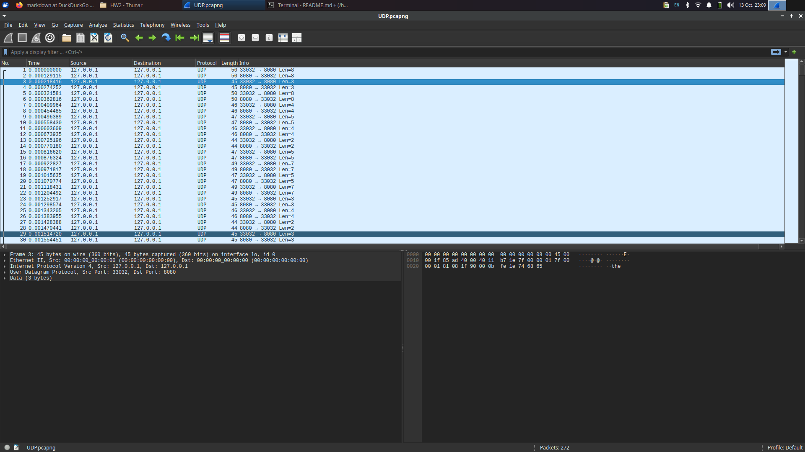
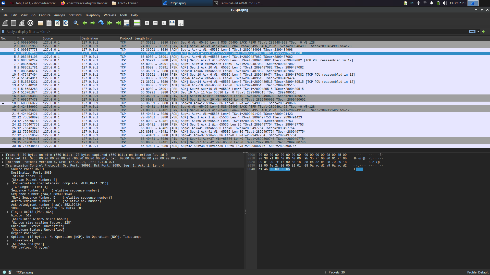
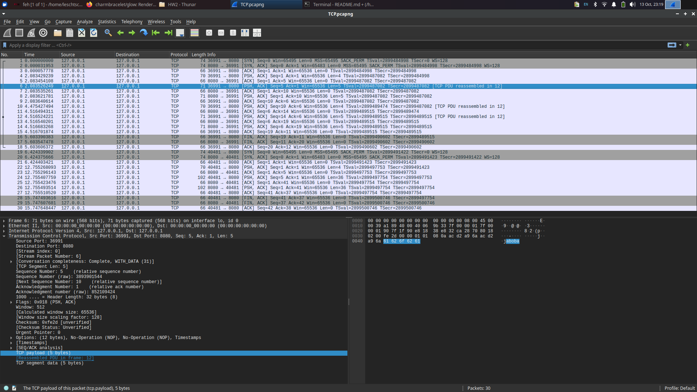
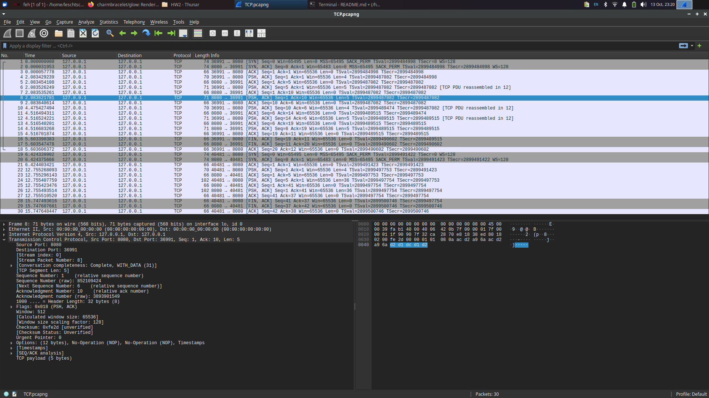

# Запуск
`RUNME.sh` или вручную через CMake
Программы будут в `bin/`

# UDP
localhost:8080

Клиент читает сообщение из терминала и отправляет на сервер.
Сервер шифрует (просто побитовый XOR) и отправляет обратно.
Клиент обратно расшифровывает, проверяя правильность.

Первое сообщение от сервера клиенту переать невозможно, так как неизвестен адрес.

Пакеты:

Мы отправили не очень информативное слово "the".

Нам отправили шифр `c7 db d6`.

# TCP
localhost:8080

Почти то же самое. Но на этот раз клиент вставляет размер сообщения, которое затем передается частями
размером с буффер сокета.

Один клиент за раз. Когда старый отключился, может прийти новый.
Превое сообщение клиенту можно отправить, но у нас, к сожалению, протокол запрос - ответ.
А так -- на сколько хватит фантазии и что прикажет программа.

Пакеты:

Мы отправили длину 5.

Мы отправили не очень информативное слово "aboba".

Нам отправили шифр `d2 d1 dc d1 d2`.

Как видно, присутствует две сессии: пакеты 1 - 18 и пакеты 19-30.
