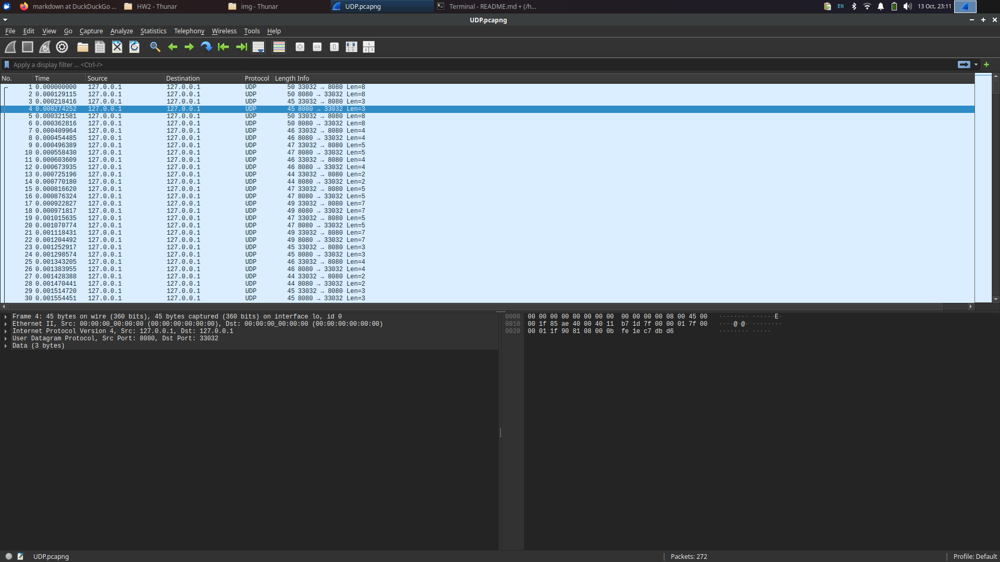

# Запуск
`RUNME.sh` или вручную через CMake
Программы будут в `bin/`

# UDP
localhost:8080

Клиент читает сообщение из терминала и отправляет на сервер.
Сервер шифрует (просто побитовый XOR) и отправляет обратно.
Клиент обратно расшифровывает, проверяя правильность.

Первое сообщение от сервера клиенту переать невозможно, так как неизвестен адрес.

Пакеты:

Мы отправили не очень информативное слово "the".

Нам отправили шифр `c7 db d6`.

# TCP
localhost:8080

Почти то же самое. Но на этот раз клиент вставляет размер сообщения, которое затем передается частями
размером с буффер сокета.

Один клиент за раз. Когда старый отключился, может прийти новый.
Превое сообщение клиенту можно отправить, но у нас, к сожалению, протокол запрос - ответ.
А так -- на сколько хватит фантазии и что прикажет программа.

Пакеты:

Мы отправили длину 5.

Мы отправили не очень информативное слово "aboba".

Нам отправили шифр `d2 d1 dc d1 d2`.

Как видно, присутствует две сессии: пакеты 1 - 18 и пакеты 19-30.

# Дорешка и ответы на вопросы.
## `INADDR_ANY`
`INADDR_ANY` биндит сокет на все интерфейсы. Если указать адрес `127.0.0.1`, то сокет привяжется только на loopback.
Кстати я забыл его сконвертировать через `htonl`, по счастью он обычно нулевой.

## Address already in use
При разрыве tcp соединения порт некоторое время остается в полуживом состоянии `TIME_WAIT`,
на случай если какие-то сообщения не дошли. Соответственно, адрес занят. `SO_REUSEADDR` позволяет нам его перезанять.

## Протоколы и программы
Протоколы не поменялись, картинки и захваченные трассы остаются актуальными.
Однако теперь можно запускаться не только на localhost:8080 и шифровать не только XOR 179.
Попробуйте `-h`.
Некоторые баги также исправлены.
